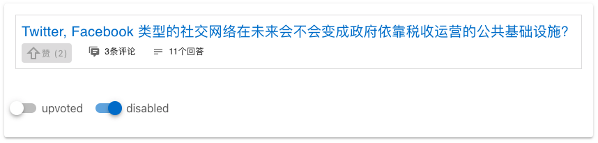

# Chafan PWA

## Local development setup

**Step 1: Install dependencies**

First, install NodeJS, npm and yarn on your OS. Then:

```
yarn install
```

Build for development and run hot-reload website:

```
yarn run serve
```

The default server connected in this setting is hosted at https://chafan-test.herokuapp.com with free dyno.
Thus, **it might be slow when you open it since the dyno will be suspended when unused for a long time and will
take a minute to restart**.


Open the "Network" URL in your browser.

## Showcase

When developing locally, you can see `/showcase` for individual static components, for exploration and design purpose. For example:



## Build production and serve locally through https

Prepare the dependencies:

```bash
brew install mkcert
mkcert -install
mkcert localhost
npm install -g serve
```

Build and serve：

```bash
VUE_APP_ENV=staging yarn run build
serve -l 8080 -s dist --ssl-cert ./localhost.pem --ssl-key ./localhost-key.pem
node e2e_tests/server.js --secure
# Open https://localhost:8080
```

## CI-built `master` previews

`master` will be deployed to https://chafan-test.netlify.app from time to time.

Please contact @izgzhen to get a invitation link to the test site. Notice that you can fill in any random verification code during registration.

If you opened a PR against `master` branch, Netlify will build a preview website too.

## Analyze production build

```
yarn run analyze
```


## Unit tests

```
yarn run test:unit
```

### Lints and fixes files

Checks:

```
yarn run check:eslint
yarn run check:prettier
```

Fixes all:

```
yarn run eslint --fix .
yarn run prettier -w .
```

## Debugging

https://github.com/Microsoft/vscode-recipes/tree/master/vuejs-cli

## Contributing

[CONTRIBUTING.md](CONTRIBUTING.md)
